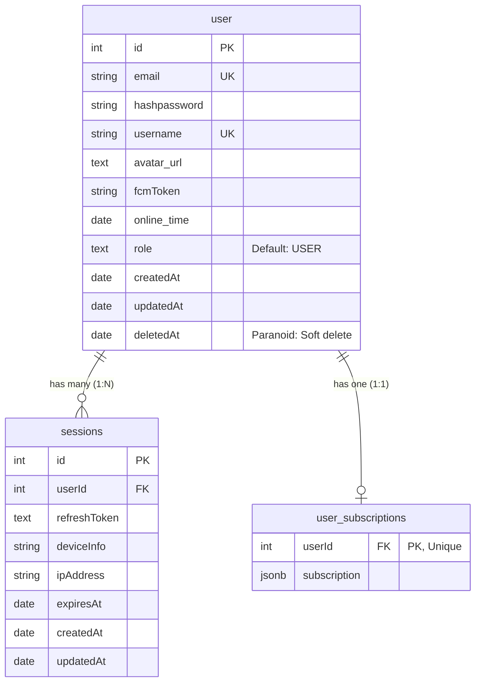
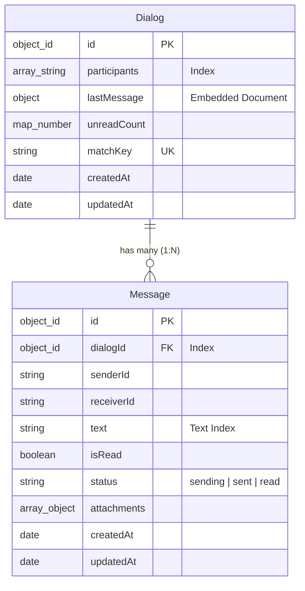
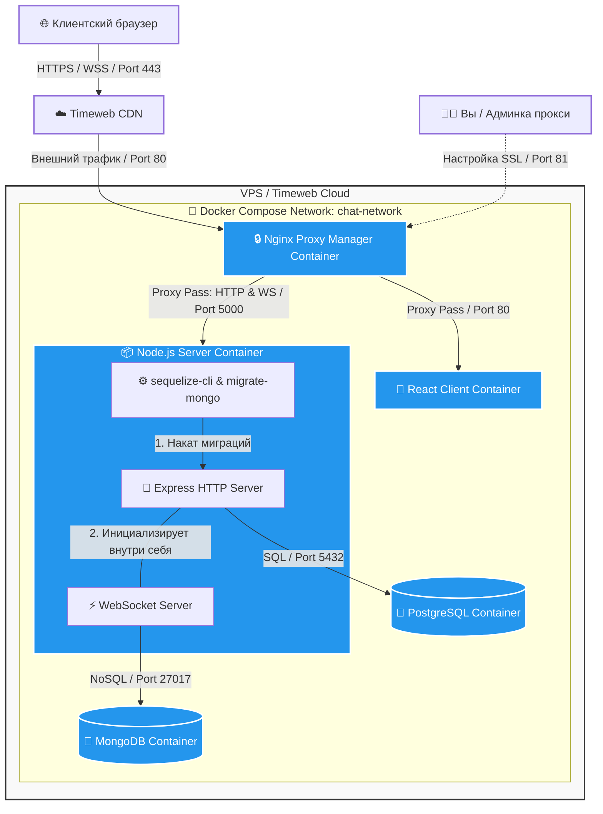

# Violanora https://violanora.ru/

Открытая социальная платформа с real-time коммуникацией, находящаяся в активной разработке. Проект создан для двух основных целей:

1. **Инженерная практика**: Отработка навыков разработки, развёртывания и поддержки публичных, отказоустойчивых систем с использованием современного стека технологий.
2. **Продуктовая реализация**: Создание независимого пространства для взаимодействия с собственным кругом пользователей, с возможностью дальнейшего расширения за пределы исходного окружения в будущем.

Проект проектировался и разрабатывался таким образом, что он послужит технической опорой для моих будущих экосистемных проектов.

---

## 🛠️ Технологический стек

### Клиент (Frontend)

- **Среда и сборка**: React 19.2.0, TypeScript, Vite 7.3.1
- **Стили и компоненты**: TailwindCSS 4.2.1, RadixUI (доступные UI-примитивы), Sonner 2.0.7 (уведомления)
- **Данные и валидация**: Axios 1.13.6, Zod 4.3.6 (строгая проверка входящих данных)
- **Архитектурный паттерн**: Feature-Sliced Design (FSD)
- **Качество кода**: ESLint, Prettier
- **Управление состоянием**: Zustand 5.0.11
- **Хранение данных**: LocalStorage

### Сервер (Backend & DB)

- **Платформа**: Node.js >=16.0.0, Express 5.2.1 (CommonJS)
- **Связь**: HTTP, WebSocket 8.19.0(двусторонний real-time обмен), WebPush API 3.6.7 (фоновые уведомления)
- **Хранение данных**:
  - **PostgreSQL** - для реляционных связей (пользователи, сессии)
  - **MongoDB** - для хранения сообщений и диалогов
- **Архитектурный паттерн**: MVC (Controller -> Service -> Repository)
- **ORM**: Sequelize 6.37.8 (для postgres), mongoose 9.3.0 (для mongo)
- **Логирование**: Pino 10.3.1

### DevOps & Инфраструктура

- **Контейнеризация**: Docker, Docker Compose
- **Прокси-сервер**: Nginx (маршрутизация, SSL)
- **Хостинг**: Timeweb Cloud (VPS) + CDN + S3 хранилище + Домен

---

## 📐 Архитектурные решения

### 1. Frontend: Feature-Sliced Design (FSD)

Клиентское приложение декомпозировано по методологии FSD (`shared`, `entities`, `features`, `widgets`, `pages`). Это исключает появление «спагетти-кода», жестко изолирует бизнес-логику от UI-компонентов и позволяет легко расширять функционал социальной сети без рефакторинга старых модулей. Глобальное состояние чатов и пользовательских сессий централизованно управляется через легковесные сторы `Zustand`.

### 2. Backend: Слоеная архитектура (Controller-Service-Repository)

Логика сервера строго разделена на три независимых уровня для прозрачности потока данных и простоты поддержки:

- **Controller**: Принимает сетевой запрос (HTTP/WS), отвечает за маршрутизацию.
- **Service**: Содержит чистую бизнес-логику приложения. Управляет бизнес-правилами, координирует отправку сообщений в WebSocket и генерирует триггеры для WebPush.
- **Repository**: Изолирует прямые запросы к базам данных. Базы данных полностью скрыты от слоя бизнес-логики.

### 3. Комбинированное хранение данных

Выбор баз данных продиктован характером и типом нагрузки:

- **PostgreSQL** обеспечивает строгую консистентность данных за счет внешних ключей и транзакций. Идеально подходит для управления учетными записями, сессиями авторизации и правами доступа.



- **MongoDB** используется под транзакционную нагрузку чатов. Документная структура позволяет быстро сохранять историю сообщений, легко реализовывать пагинацию (курсоры) и добавлять метаданные к диалогам без изменения общей схемы БД.



---

## 🧠 Технические вызовы и их решение

В ходе разработки я столкнулся с рядом критических проблем, решение которых позволило глубже понять внутреннее устройство веб-технологий:

### 1. Борьба за Service Worker и WebPush в разных браузерах

- **Проблема**: Жизненный цикл Service Worker ведет себя непредсказуемо в зависимости от браузера. Особенно много проблем возникло с десктопной и мобильной Opera (из-за агрессивных встроенных механизмов энергосбережения и блокировок фоновой активности), где фоновые пуши периодически «засыпали» и не доставлялись пользователю.
- **Решение**: Была реализована детальная отладка регистрации воркера через `navigator.serviceWorker.ready` и настроена явная синхронизация payload. Полностью победить специфику энергосбережения Opera без явного разрешения пользователя в настройках браузера сложно, поэтому в приложении был проработан Fallback-сценарий: если Service Worker недоступен или спит, система дублирует важные уведомления через активную WebSocket-сессию, если вкладка открыта.

### 2. Мультипликация и наложение WebSocket-соединений

- **Проблема**: Из-за особенностей жизненного цикла компонентов в React (особенно при Strict Mode в разработке) кастомные хуки сокетов постоянно пересоздавали соединения. Это приводило к «наложению» сокетов друг на друга: один клиент плодил по 5-10 активных сессий, забивал память бэкенда и получал дубликаты сообщений.
- **Решение**: Логика работы с WebSocket была вынесена из локальных хуков компонентов и инкапсулирована непосредственно в глобальный стор `Zustand`. Был реализован паттерн _Singleton_ для инстанса сокета, а также добавлены механизмы `cleanup` (отписка и закрытие старого коннекта при размонтировании приложения) и стратегия контролируемого экспоненциального перезапуска (Exponential Backoff) при разрыве сети.

### 3. Автоматизация миграций для сохранения консистентности данных

- **Проблема**: На начальном этапе при любом изменении схем приходилось вручную пересоздавать базы данных и заново регистрировать тестовых пользователей, что парализовало разработку и ломало связи между PostgreSQL и MongoDB.
- **Решение**: Процесс управления базами данных был полностью автоматизирован. Внедрены `sequelize-cli` для реляционной структуры и `migrate-mongo` для документов. Все скрипты миграций упакованы в единый пайплайн запуска контейнера бэкенда (`sh -c "npx sequelize-cli db:migrate && npx migrate-mongo up && node index.js"`). Теперь структура таблиц и коллекций обновляется инкрементально при каждом перезапуске без потери существующих данных пользователей.

### 4. Отказоустойчивость: Централизованная обработка ошибок и логирование (Pino)

- **Проблема**: На ранних этапах непредвиденные ошибки (например, невалидный JSON, упавший запрос к БД или разрыв сокета) приводили к падению Node.js процесса (`uncaughtException`). На стороне клиента это вызывало «белый экран» или бесконечный лоадер, полностью ломая UX. Использование стандартного `console.log` не давало структуры логов и сильно просаживало производительность бэкенда под нагрузкой сокетов.
- **Решение**:
  - **На бэкенде**: Внедрен кастомный глобальный Error Handling Middleware. Все асинхронные роуты обернуты в перехватчики ошибок, которые форматируют ответ в единый стандарт `{ error: "Message", code: 500 }` и отдают клиенту безопасный HTTP-статус без падения процесса. Для логирования интегрирован высокопроизводительный логгер `Pino`. Логи структурированы в JSON-формат, разделены по уровням (info/warn/error) и готовы к агрегации, не блокируя event loop сервера.
  - **На фронтенде**: Настроены перехватчики (interceptors) в `Axios` для централизованной обработки ответов от глобального middleware сервера. Любая ошибка бэкенда корректно перехватывается и выводится пользователю в виде понятного и красивого уведомления через `Sonner Toaster`, предотвращая падение интерфейса.

---

## 🌐 Диаграмма развёртывания



---

## ⚡ Быстрый старт (Локальное развертывание)

Для локального запуска всей экосистемы проекта необходимы установленные `Docker` и `Docker Compose`.

1. **Клонирование проекта**:

   ```bash
   git clone https://github.com
   cd Violanora
   ```

2. **Настройка переменных**:
   Создайте файлы конфигурации `.env` в папках `./frontend` и `./backend` на основе шаблонов `.env.example`.

3. **Сборка и запуск контейнеров**:
   ```bash
   docker-compose up --build -d
   ```
   _Docker Compose автоматически выполнит сборку фронтенда, развернет базы данных PostgreSQL и MongoDB, запустит Node.js сервер и настроит Nginx Proxy Manager в качестве единой точки входа._

---

## 📬 Контакты и связь

Если вам понравился проект или вы хотите обсудить мои инженерные решения подробнее, я открыт к диалогу и предложениям о работе:

[](https://t.me/ALL_MIGHT_DANIL)
[](mailto:lopatin1945@bk.ru)
